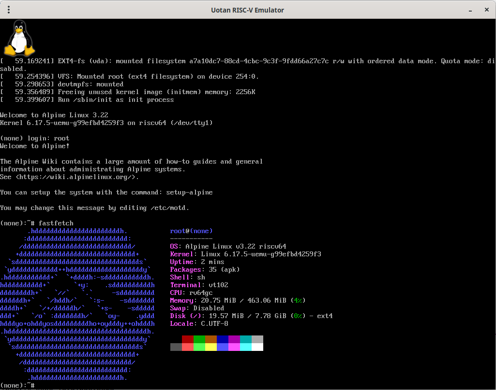
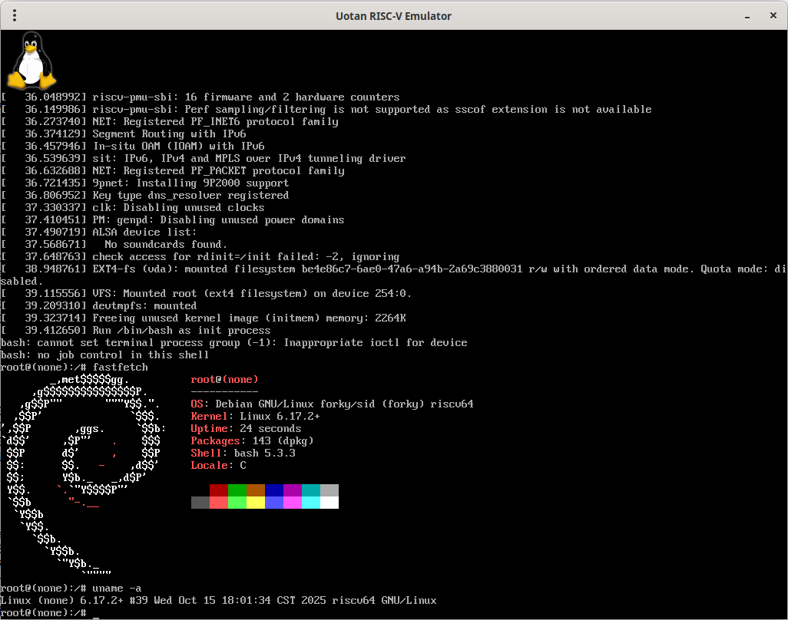

# Uotan Emulator — tiny RISC-V system emulator

**Uotan Emulator** (*uemu*) is a small rv64gc system emulator that boots real firmware and OS images (OpenSBI, U-Boot, Linux) and runs raw/ELF test binaries.

**Uotan Emulator** supports the following RISC-V ISA features:
* RV64I base ISAs, v2.1
* Zifencei extension, v2.0
* Zicsr extension, v2.0
* Zicntr extension, v2.0
* M extension, v2.0
* A extension, v2.1
* F extension, v2.2
* D extension, v2.2
* C extension, v2.0
* Svadu extension, v1.0
* Svade extension, v1.0

## Boot Demo
### Alpine Linux v3.22


### Debian Forky without systemd :(


## Quick facts

* **Type**: system emulator (physical memory + platform devices).
* **Accepts**: raw binaries and ELF images.
* **GDB**: supported (`--gdb`).
* **Built devices**:

  * DRAM: `0x80000000` — `0x9fffffff` (512MB)
  * CLINT: `0x02000000` — `0x0200FFFF`
  * PLIC: `0x0C000000` — `0x0FFFFFFF`
  * UART16550 (console), Goldfish RTC, goldfish-events, goldfish-battery, SIFIVE TEST, simple-framebuffer, virtio-blk.

## Host dependencies

Install these on your host before building:

* `cmake` (≥3.14), `make`, `gcc`/`g++` (build tools)
* `pkg-config`
* `libsdl3-dev` (SDL2 development package)
* `git`
* `riscv64-unknown-elf-gcc`, `riscv64-unknown-elf-objcopy`, `riscv64-unknown-elf-objdump`
* (Optional) `gdb-multiarch` or other riscv gdb for remote debugging

## Fetch the code

```bash
git clone --depth=1 --recursive https://github.com/snnbyyds/uemu.git
```

## Build

```bash
mkdir build
cd build
cmake -DCMAKE_BUILD_TYPE=Release ..
make -j$(nproc)
```

This produces:

* `uemu` (the emulator)
* `run_tests` (GoogleTest host test runner)

Notes:

* The build fetches GoogleTest automatically.
* A small `mini-gdbstub` library is built via the CMake custom target and linked into `uemu`.

## Run examples

Run an image (raw or ELF):

```bash
./uemu path/to/image.bin
```

Run with gdbstub enabled:

```bash
./uemu --gdb path/to/image.elf
# then connect from your RISC-V GDB (example)
riscv64-unknown-elf-gdb path/to/image.elf
(gdb) target remote localhost:1234   # adjust port per your gdbstub config
```

For running OpenSBI and Linux, refer to [Booting Linux on uemu](https://github.com/snnbyyds/uemu/blob/dev/software/README.md) or try out the prebuilt binary in [releases](https://github.com/snnbyyds/uemu/releases).

An incomplete [nexus-am](https://github.com/OpenXiangShan/nexus-am) (@OpenXiangShan's fork of The Abstract Machine) port is provided at https://github.com/snnbyyds/nexus-am

For [*Introduction to Computer System*](https://nju-projectn.github.io/ics-pa-gitbook/) students, porting [Abstract Machine](https://github.com/NJU-ProjectN/abstract-machine) and [Nanos-lite](https://github.com/NJU-ProjectN/nanos-lite) is an exercise.

## Boot Alpine Linux

The Alpine rootfs, kernel image and OpenSBI firmware used in this example are provided in the `20251030` release on the project releases page. Download the required assets from that release before continuing. See https://github.com/Uotan-Dev/uotan_riscv_emu/releases/tag/20251030

### Required files

* `uemu` — the emulator binary (build from source; see **Build** above)
* `fw_jump.elf` — OpenSBI binary
* `Image` (the Linux kernel image) from the release
* `alpine-<...>.tar` — Alpine rootfs tarball from the release

### Steps

Create a 512 MiB empty disk image and format it as `ext4`:

```bash
dd if=/dev/zero of=disk.img bs=1M count=512
mkfs.ext4 disk.img
```

Mount the image with a loop device, extract the Alpine rootfs into it, then unmount:

```bash
mkdir -p mnt
sudo mount disk.img mnt
cd mnt
# replace the tar filename with the Alpine tarball you downloaded from the release
tar -xvf /path/to/alpine-<version>.tar
cd ..
sudo umount mnt
```

Run the emulator, point it at `fw_jump.elf`, load the kernel `Image` at `0x80200000`, and attach the `disk.img`:

```bash
/path/to/uemu /path/to/fw_jump.elf --load /path/to/Image@0x80200000 --disk /full/path/to/disk.img
```

## Unit / integration tests

* Unit / integration tests are bundled into `run_tests` (GoogleTest). Execute:

```bash
# from build/
./run_tests
# or use CTest
ctest
```

## Run riscv-arch-test via RISCOF

For formal architecture testing / regression harnesses, use RISCOF. See the official RISCOF documentation and usage guide:
[https://riscof.readthedocs.io/en/stable/](https://riscof.readthedocs.io/en/stable/)

### Install RISCOF

```bash
pipx install riscof
```

### Reference model (REF)

This setup uses the **RISC-V Sail Model 0.7**: [https://github.com/riscv/sail-riscv/tree/0.7](https://github.com/riscv/sail-riscv/tree/0.7)
Build the Sail model per its README and add the resulting binaries to `$PATH`.

### Generate `config.ini`

```bash
cd verif
./generate_config.py
```

### Run tests

```bash
riscof run --config=config.ini --suite=../riscv-arch-test/riscv-test-suite/ --env=../riscv-arch-test/riscv-test-suite/env
```

[A recent test report](https://github.com/snnbyyds/uemu/blob/main/verif/Test%20Report.pdf)

## Plan for JIT
Visit [uemu_jit_plan](https://github.com/Uotan-Dev/uemu_jit_plan) for our plan for JIT implementation.

## Notes

* **uemu** implements **rv64imafdc_zicsr_zifencei** only. Images built for other extensions may fail or trap.

* ~~**riscv-arch-test** submodule has been set to our own fork due to GitHub issue [LA macro generates compressed instructions for platform that does not support C extension #659](https://github.com/riscv-non-isa/riscv-arch-test/issues/659)~~

## Known bugs

### Hardware simulation
* ~~Some CSRs like `menvcfg` is unimplemented.~~
* Other misc bugs.

### Linux experience
* ~~The system can't shut down properly with `poweroff`.~~
* `agetty` does not start properly on **Debian**.
* `dbus` fails to start on **Buildroot**.
* ~~The keyboard (implemented with **goldfish-events**) sometimes **freezes under certain conditions**.~~

## TODO

Due to the limitation of the author's ability, 
planned and ongoing work for future versions of **uemu** includes:

* ~~**Full RV64GC support**~~
* **JIT compilation** — introduce a lightweight dynamic translation layer for improved performance.
* **Full keyboard and mouse support**
* **Support for modern Linux distros** - Debian, archlinux or any other excellent Linux distributions.
* **Emulation for more devices** - mouse, GPU etc.

Contributions, testing, and feedback are welcome to help bring these features to completion.

## Acknowledgments

uemu draws inspiration from several excellent open-source projects.

[qemu/qemu](https://github.com/qemu/qemu), [NJU-ProjectN/nemu](https://github.com/NJU-ProjectN/nemu), [sysprog21/rv32emu](https://github.com/sysprog21/rv32emu), [snnbyyds/semu](https://github.com/snnbyyds/semu), and [bane9/rv64gc-emu](https://github.com/bane9/rv64gc-emu) for inspiration.

[@cocowhy1013](https://github.com/cocowhy1013), [@jiangyy](https://github.com/jiangyy), and [@sashimi-yzh](https://github.com/sashimi-yzh) for their course [*Introduction to Computer System*](https://nju-projectn.github.io/ics-pa-gitbook/).

[@cocowhy1013](https://github.com/cocowhy1013) and [@hengxin](https://github.com/hengxin) for their course [*C Programming Language*](https://docs.cpl.icu/#/).

[@BigfootACA](https://github.com/BigfootACA), [@redstonee](https://github.com/redstonee), [@sanpeqf](https://github.com/sanpeqf), and [@sunflower2333](https://github.com/sunflower2333) for their valuable advice and experience.

[@luboyang-a](https://github.com/luboyang-a), [@lbb-and-a-little-rabbit](https://github.com/lbb-and-a-little-rabbit), [@mujianwu](https://github.com/mujianwu) and [@VGamerCTroller](https://github.com/VGamerCTroller) for their support for this project.
